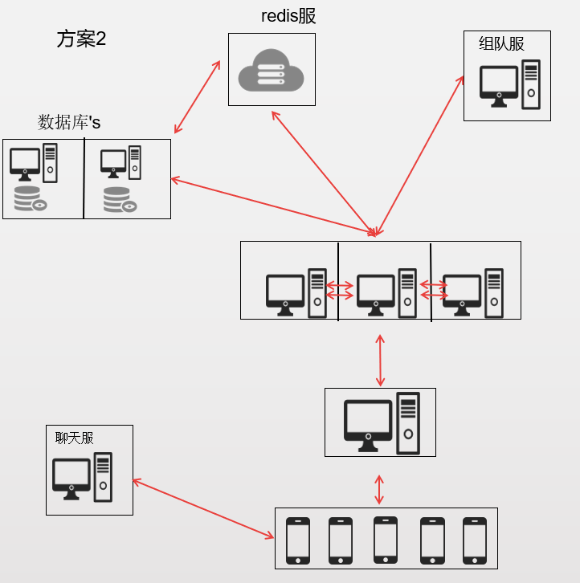

# gameserver

<p>
qq:874807132
</p>

## 前言

`gameserver` 是一个分布式java游戏框架，采用现阶段流行技术实现。

## 项目介绍

`gameserver`项目是一个java游戏框架，包括测试用client,netty客户端.</p>
基于Spring+netty+redis+自定义rpc(或者dubbo)+MyBatis + mysql(或者mongodb)实现。</p>
socket通信实现,登录系统,玩家线程模型,db系统,分布式id生成器,分布式锁,缓存系统,热更新机制,rpc系统,全服组队等等

### 组织结构

``` lua
gameserver
├── client -- 测试用netty客户端
├── rpc-api -- 提供分布式的rpc基础
├── server-common -- 支持包
├── server-db -- 数据落地系统 基于redis缓存+mysql 也提供了mongodb
├── server-gate -- 大部分游戏逻辑模块
└── server-team -- 提供跨服组队的demo
```

### 技术选型

#### 后端技术

技术 | 说明 | 官网
----|----|----
Spring | 容器+MVC框架 | [https://spring.io/projects/spring-framework](https://spring.io/projects/spring-framework)
Netty | 网络容器 | [https://netty.io/](https://netty.io/)
MyBatis | ORM框架  | [http://www.mybatis.org/mybatis-3/zh/index.html](http://www.mybatis.org/mybatis-3/zh/index.html)
MyBatisGenerator | 数据层代码生成 | [http://www.mybatis.org/generator/index.html](http://www.mybatis.org/generator/index.html)
Dubbo | 分布式rpc框架 | [http://dubbo.apache.org/zh-cn/](http://dubbo.apache.org/zh-cn/)
Redis | 分布式缓存 | [https://redis.io/](https://redis.io/)
MongoDb | NoSql数据库 | [https://www.mongodb.com/](https://www.mongodb.com/)
Druid | 数据库连接池 | [https://github.com/alibaba/druid](https://github.com/alibaba/druid)
Protobuf | 序列化框架 | [https://developers.google.cn/protocol-buffers/](https://developers.google.cn/protocol-buffers/)
ProtoStuff | RunTime Protobuf | 

#### 架构图

##### 系统架构图




#### 开发进度

等待完成

## 环境搭建
等待完成

### 开发环境

工具 | 版本号 | 下载
----|----|----
JDK | 1.8 | https://www.oracle.com/technetwork/java/javase/downloads/jdk8-downloads-2133151.html
Mysql | 5.7 | https://www.mysql.com/
Redis | 4.x | https://redis.io/download
MongoDb | 3.2 | https://www.mongodb.com/download-center
nginx | 1.10 | http://nginx.org/en/download.html

## 项目相关文档

等待开发

## 参考资料
- [Spring实战（第4版）](https://book.douban.com/subject/26767354/)
- [Spring Data实战](https://book.douban.com/subject/25975186/)
- [MyBatis从入门到精通](https://book.douban.com/subject/27074809/)
- [深入浅出MySQL](https://book.douban.com/subject/25817684/)
- [循序渐进Linux（第2版）](https://book.douban.com/subject/26758194/)
- [MongoDB实战(第二版)](https://book.douban.com/subject/27061123/)
